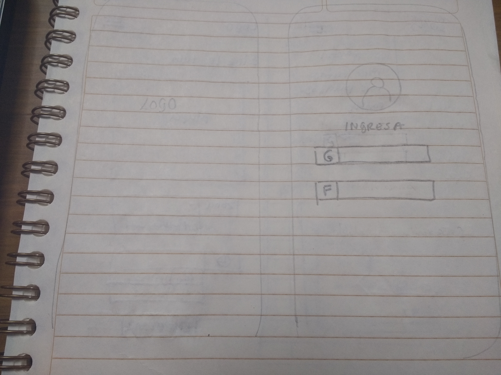
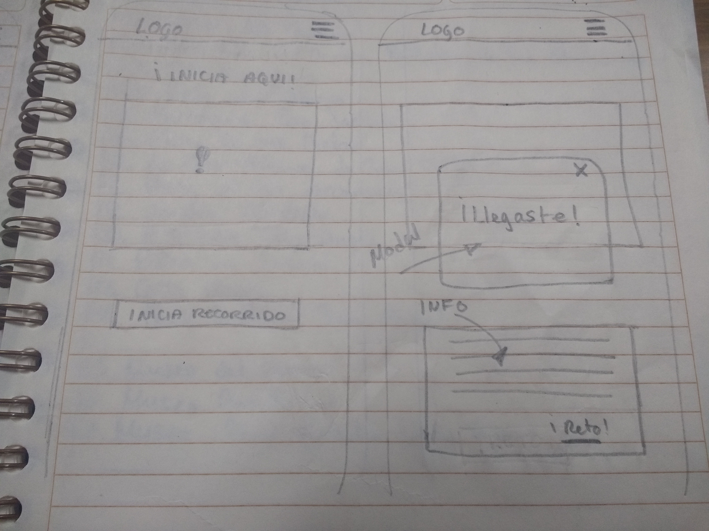
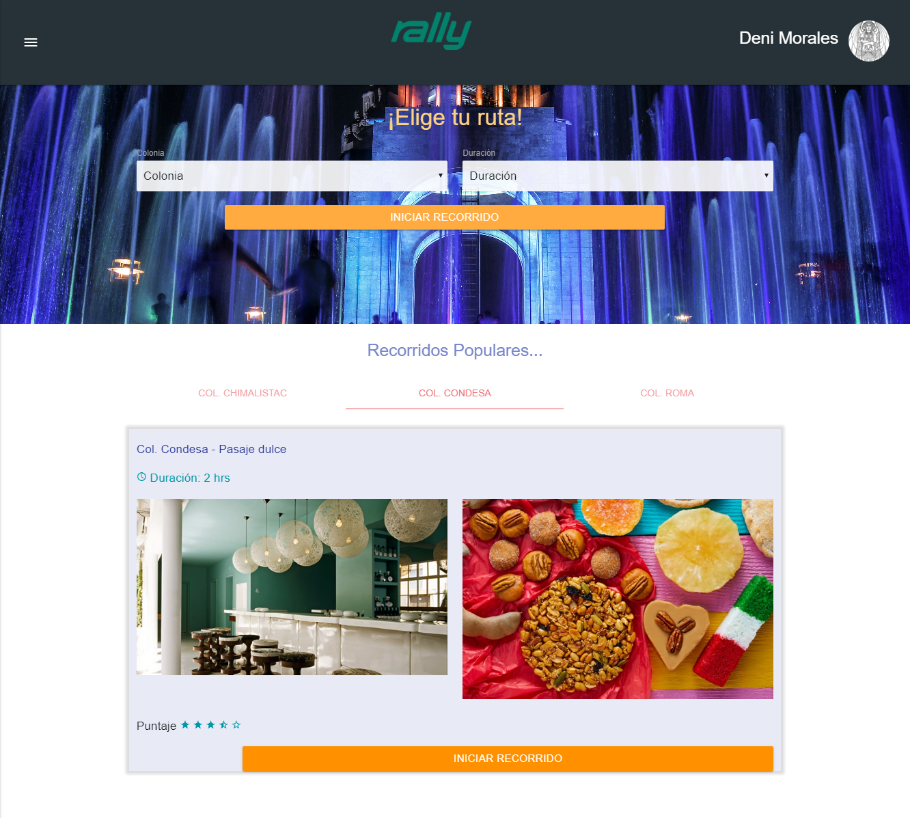
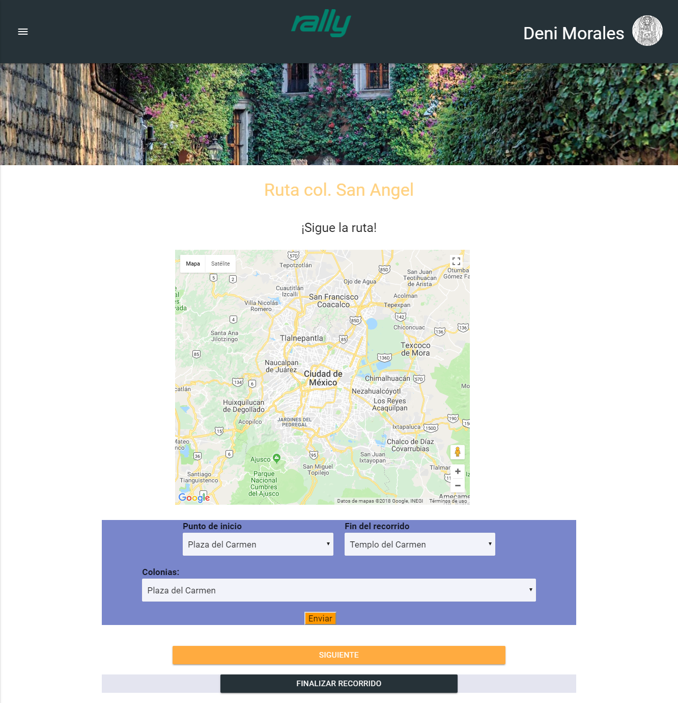
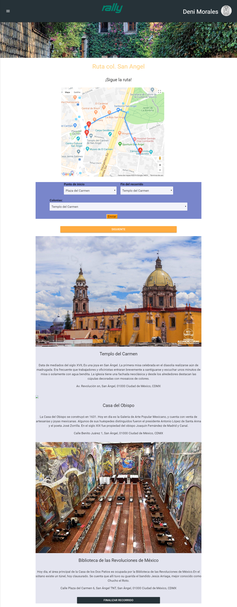
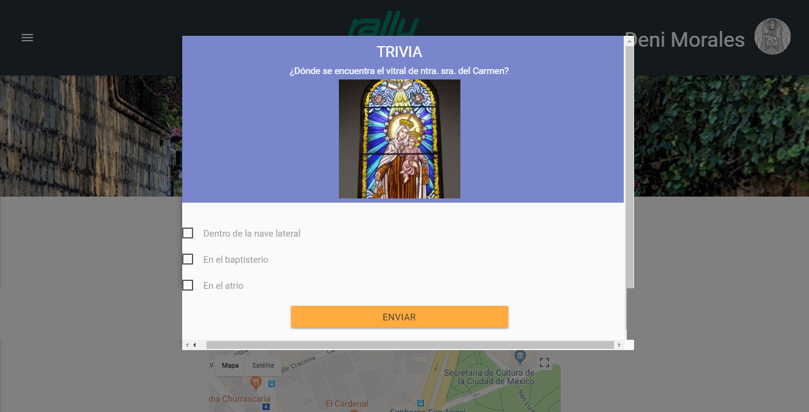
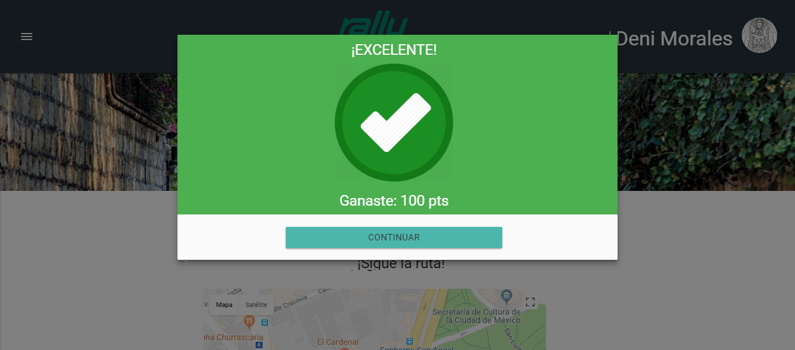
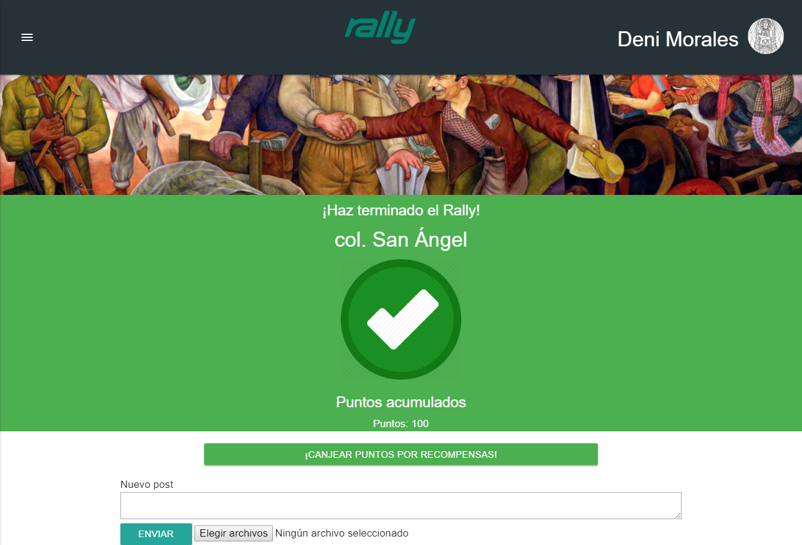

# Rally CDMX

## Squad
Equipo de trabajo conformado por:

* Carolina Barrios
* Tania Herrera
* Dení Morales
* Paulina Vargas

## El reto

Crear en el transcurso de una semana un aplicación enfocada al entretenimiento y que contenga por lomenos una API. 

## El producto

Decidimos crear una web app que permite que el usuario recorra barrios de la ciudad de México de manera divertida, conociendo puntos poco conocidos pero relevantes de cada colonia a través de rutas preestablecidas. 

## Objetivos

* Crear una aplicación accesible, divertida y facil de usar
* Generar Turismo de barrio, que incentive la economía local

## Proceso de selección del producto

Iniciamos con  una lluvia de ideas y hubo un debate sobre la primera propuesta, que se trataba de  realizar una web misteriosa con archivos ocultos con esteganografía y acertijos. Sin embargo, no se pudo aterrizar el cómo sería la utilización de API's.
Testeamos entre nosotras y algunas de nuestras compañeras nuestros gustos y hábitos en cuanto a entretenimiento se trata y coincidimos en crear una app de paseos guiados.
Se habló acerca de un tour por zonas de la Cd de México con diversidad cultural e implementamos nuevamenta la primera propuesta de hacerlo a manera de juego realizando retos en cada parada que realice el usuario en la zona de una ruta pre-establecida.  

## Requerimientos

* Establecer rutas interesantes y fáciles de seguir.
* Plantear retos divertidos en cada punto del recorrido
* Acceder a la data necesaria para realizar la geolocalización.
* Ser mobile friendly

## Validando la idea

* A pesar que existen tours para los turistas que visitan la Cd de México, no existe alguno que funcione de la manera en que lo planteamos. Solía haber una aplicación que funcionaba con código QR, pero aunque se sabía de su existencia por los señalamientos en algunos sitios, nadie la había usado.
* La modalidad de juego hará del recorrido algo divertido para toda la familia.
* Ofrecer recompensas a través de los puntos adquiridos mediante los retos, lo cuál mantiene la motivación durante el recorrido hasta llegar a la meta.
* Canjear puntos por productos, servicios o experiencias de las empresas con lo que obtengamos convenios. También se puede optar por cupones de descuentos.
* Es una actividad familiar, económica y accesible para todo público. 

##### Sitios similares
Corredor Roma-Condesa ccromacondesa.mx

## Agenda

**Dia 1:**
1. Lluvia de ideas para elegir el tema en el que se basará nuestro producto
2. Investigación de API
3. Elegir las ideas en las que se crea encontrar problematicas
4. Creación de un plan: Estimación de tiempo/tareas herramienta utilizada: Trello
5. Asignación de roles: UX Y frontend
6. Investigación de producto para UX
7. Determinar las problemátcas de funcionalidad, sólo frontend
8. Armar una solución al problema

**Dia 2:**
ÁREA UX
1. Darle un nombre a nuestra solución
2. Crear paleta de colores de nuestra web-app
3. Crear un logotipo
4. División de tareas por vistas en la app

ÁREA FRONTEND
1. Geolocalización
2. Waypoints
3. Coincidencias con la Data

**Dia 3:**
1. Funcionalidad completa de Google Maps API
2. Maquetación completa
3. Implemetación de retos por cada punto clave del recorrido

**Dia 4:**
1. Detalles de funcionalidad y maquetación
2. GitHub colaborativo

## LA INTERFAZ

## Definición del diseño

Nombre: Rally CDMX 
Sketching:

## Log in

## Home

## Elegir recorrido

## La Trivia

## Los Puntos

## DISEÑO DE EXPERIENCIA DE USUARIO

### Definición de Turismo de Barrio

A pesar de que existen diversas herramientas y aplicaciones enfocadas en turistas y viajeros, éstas se enfocan en lugares comunes como los museos, zonas arqueológicas y sitios históricos más populares.

Lo que nosotras proponemos como "Turismo de Barrio" se trata de paseos que se puedan realizar a pie en pocas horas, recorriendo lugares que no sean necesariamente conocidos pero que aporten valor a los visitantes, ya sea por su arquitectura, belleza, anécdotas históricas, leyendas o alguna otra característica interesante. 

Esto hace del Turismo de Barrio una actividad no sólo entretenida sino económica, incluyente y adecuada para toda la familia.

## Objetivos de negocio

A través de la aplicación de Rally, generar Turismo de Barrio que pueda potenciar la economía local.
Ofreceremos Rally de manera gratuita, de modo que los ingresos de la aplicación llegarán a través de los convenios y acuerdos que se puedan negociar con los comerciantes y locatarios de la zona. Podrán participar pagando una cuota mensual por anunciarse y ofreciendo beneficios a l@s usuari@s de la aplicación.

## Selección del Barrio 

Elegimos iniciar con el barrio de San Ángel por las siguientes razones

* Es un lugar con atractivo turístico pero con áreas poco conocidas
* Es un lugar rico en leyendas
* Posee atractivo arquitectónico
* Hay sitios sencillos pero cuyo valor radica en la belleza, la tranquilidad, la vegetación u otras características particulares 
* Es accesible para llegar en transporte público (queremos incentivar la caminata)
* Hay diversos sitios para comer, descansar o adquirir una amplia diversidad de productos
* Es accesible para una amplia variedad de perfiles
* Hay museos y teatros con oferta cultural para quien desee complementar su recorrido

Se planteó una ruta basándonos en google maps y posteriormente se validó haciendo el recorrido a pie.

## San Ángel: Validación del recorrido

A través de recorrer la ruta nos aseguramos de que el paseo:

* Fuera seguro
* Cómodo
* Atractivo
* Entretenido
* Económico
* Tuviera zonas de descanso
* Contara con servicios de alimentos o bebidas
* Comercialmente activo
* Planteara retos interesantes

## Conclusiones 

* La ruta no solo cumplió nuestros objetivos sino que superó nuestras expectativas
* Es posible que los horarios de ciertos recintos varíen de acuerdo al día de la semana
* Hay comerciantes entusiasmados con participar en la aplicación
* Las personas sí la usarían

## Mejoras para el futuro

* Añadir rutas
* Mejorar y modernizar la interfaz 
* Mejorar y modernizar la interacción
* Segmentar mejor los perfiles de usuario para personalizar los recorridos (parejas, familias, turistas, etc.)
* Personalizar las opciones de anuncios y ofertas
* Añadir una funcionalidad de monedero o pago desde la aplicación
* Añadir un calendario o cartelera que indique los eventos disponibles en recintos cercanos el día del recorrido
* Añadir la opción de compara de boletos para obras de teatro, entradas a museos, conciertos, etc.

